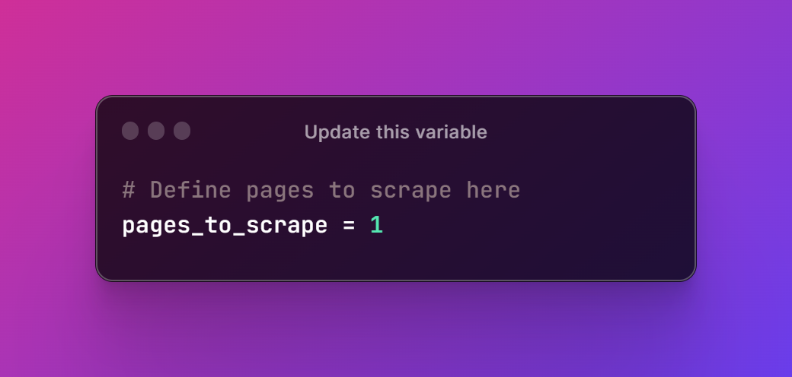

# Car Data Scraper 🚗 
This Python script is designed to scrape car data from Cars.com for use in machine learning and automotive analysis Business Intelligence. The script uses the BeautifulSoup library to extract information from the website and saves the data in a CSV file.

### How to Use 👩🏽‍🏫
To use this scraper, simply update the pages_to_scrape variable with the number of pages you want to scrape. You can also modify the URL in the scrape_car_data function to specify additional filters (e.g. car make, model, price, etc.).

To run the script, you will need to have the following Python libraries installed: requests, BeautifulSoup, time, csv, random, datetime, and fake_useragent.

### Data Collected
The script collects the following data for each car listing:
- Car Name
- Car Price
- Car Mileage
- Exterior Color
- Interior Color
- Drivetrain
- Fuel Type
- Transmission
- Engine
- VIN
- TimeStamp
- Source

The data is saved in a CSV file named "car_data_{date_string}.csv" with the date and time of scraping included in the file name. The file will be created in the same directory as the script.

# Disclaimer
Please note that web scraping can be against the terms of service of some websites. Use this script at your own risk and ensure that you have the necessary legal permissions to scrape data from Cars.com.
